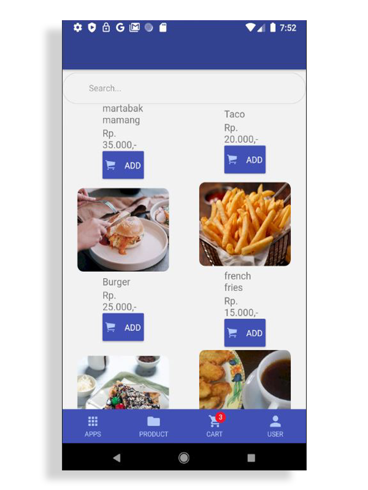
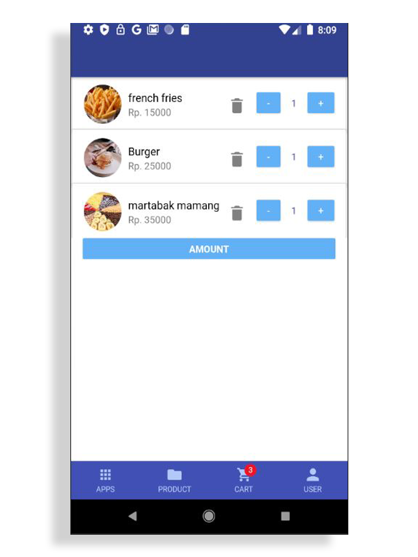
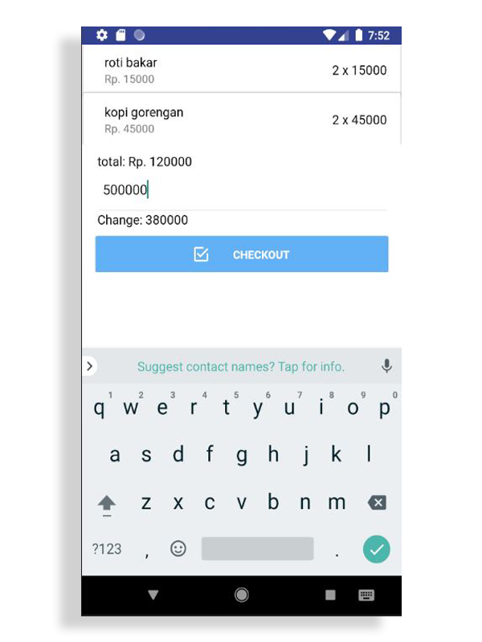
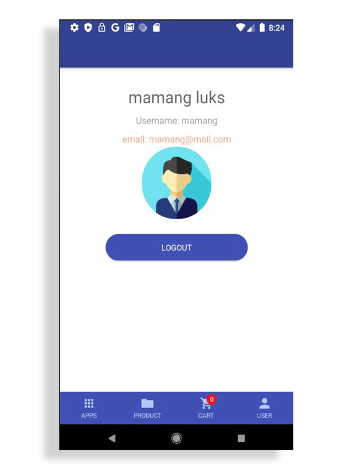

<h1 align="center">
  <a href="">
  </a>
</h1>

<p align="center">
  <a href="https://github.com/facebook/react-native/blob/master/LICENSE">
    
  </a>
  <a href="https://circleci.com/gh/facebook/react-native">
    
  </a>
  <a href="https://www.npmjs.org/package/react>
    
  </a>
  <a href="https://reactnative.dev/docs/contributing">
    
  </a>
</p>

## SCREENSHOOT DEMO
- <b>Product </b>


- <b> Home </b>


- <b> Cart </b>


- <b> Payment </b>


- <b> Profile </b>



## APK RELEASE


## Table Of Contents
*  [Intro](#Intro)
*  [Requirments](#Requirments)
*  [Related Projects](#Related-Projects)
*  [Dependencies](#Dependencies)
    *  [Clone Repo](#Clone-Repo)
    *  [Install Depedencies](#Install-Depedencies)
    *  [Update Depedencies](#Update-Depedencies)
    *  [Setup Environment](#Setup-Environment)
    *  [Run server development](#Run-server-development)
    *  [Build For Production](#Build-For-Production)
* [Dependencies](#Dependencies)
* [License](#License)
___
### Intro

WayahNgopi is a point of sale application covering all sales features starting from
product management, category management, orders, and payment amount. This application was created using
Reacts Native and backend using Express and MySQL.

___
### Features
- [x] Manage Product (CRUD)
- [x] Manage Category (CRUD)
- [x] Manage User (CRUD)
- [x] Fancy UI Design
- [x] Simple Add to cart and manipulate quantity in checkout
- [x] Order product
- [x] Count payment receipt
- [x] Authentication with JWT in backend
- [x] Persist and rehydrate a redux store
___
### Requirments

* [Nodejs](https://nodejs.org/en/) v10 LTS version
* [Npm](https://www.npmjs.com/get-npm) package / [Yarn](https://yarnpkg.com/lang/en/docs/install/#mac-stable) package
___

### Related Projects
This project is related to several platforms

* Backend [https://github.com/rifkiandriyanto/wayahNgopi-Backend](https://github.com/rifkiandriyanto/wayahNgopi-Backend)
* Web App [https://github.com/rifkiandriyanto/wayahNgopi-frontendWeb](https://github.com/rifkiandriyanto/wayahNgopi-frontendWeb)
* Mobile App [https://github.com/rifkiandriyanto/wayahNgopi-frontendMobile](https://github.com/rifkiandriyanto/wayahNgopi-frontendMobile)
___

### Installation

##### Clone Repo
clone the repository

```sh
$ git clone https://github.com/rifkiandriyanto/wayahNgopi-frontendMobile
$ cd point-of-sale-frontend
```

##### Install Depedencies

```sh
$ npm install
```

##### Update Depedencies

```sh
$ npm update
```

##### Setup Environment
Before project development or build for production, you should create new .env file, edit API_KEY  variable to backend server. you can found the backend server here.. [https://github.com/rifkiandriyanto/wayahNgopi-Backend](https://github.com/rifkiandriyanto/wayahNgopi-Backend)

```sh
API_KEY=<Backend-api-url>
```

##### Run on android device
if you want start on development mode.

```sh
$ npx react-native run-android
```

##### Run on ios device
if you want start on development mode.

```sh
$ npx react-native run-ios
```

##### Build For Production
build for production ready, and host ready

```sh
$ cd android && ./gradlew --assembleRelease
```
___

### Dependencies

List of depedencies using in this project

| Plugin | Description |
| ------ | ------ |
| [React Native](https://facebook.github.io/react-native/) | Mobile Apps Framework |
| [Axios](https://github.com/axios/axios) | HTTP client for request API |
| [Redux](https://redux.js.org) | Global State Management |
| [Redux Promise Middleware](https://www.npmjs.com/package/redux-promise-middleware) | Promise handler for react redux 
| [Redux Promise Persist](https://www.npmjs.com/package/redux-persist) | Persist and rehydrate a redux store
| [React Native dotenv](https://www.npmjs.com/package/react-native-dotenv) | Ract Native dotenv

License
----

MIT


@2020 - Rifki Andriyanto
